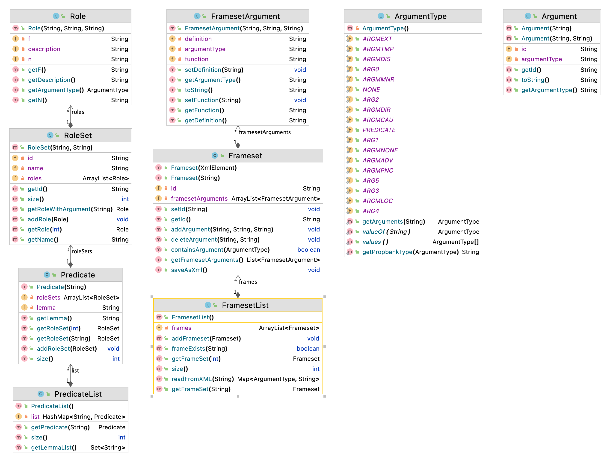

Turkish PropBank (TRopBank)
============

Turkish PropBank (TRopBank) is a corpus of over 17.000 Turkish verbs, each annotated with their syntactic arguments and thematic roles. Arguments are bits of essential information attached to a verb (such as subject or object), and thematic roles are semantic classifications associated with these arguments (such as agent or patient). This resource allows matching between the syntax layer and the semantics layer for the processing of Turkish data.

In the field of SRL, PropBank is one of the studies widely recognized by the computational linguistics communities. PropBank is the bank of propositions where predicate- argument information of the corpora is annotated, and the semantic roles or arguments that each verb can take are posited.

Each verb has a frame file, which contains arguments applicable to that verb. Frame files may include more than one roleset with respect to the senses of the given verb. In the roleset of a verb sense, argument labels Arg0 to Arg5 are described according to the meaning of the verb. For the example below, the predicate is “announce” from PropBank, Arg0 is “announcer”, Arg1 is “entity announced”, and ArgM- TMP is “time attribute”.

[<sub>ARG0</sub> Türk Hava Yolları] [<sub>ARG1</sub> indirimli satışlarını] [<sub>ARGM-TMP</sub> bu Pazartesi] [<sub>PREDICATE</sub> açıkladı].

[<sub>ARG0</sub> Turkish Airlines] [<sub>PREDICATE</sub> announced] [<sub>ARG1</sub> its discounted fares] [<sub>ARGM-TMP</sub> this Monday].

The following Table shows typical semantic role types. Only Arg0 and Arg1 indicate the same thematic roles across different verbs: Arg0 stands for the Agent or Causer and Arg1 is the Patient or Theme. The rest of the thematic roles can vary across different verbs. They can stand for Instrument, Start point, End point, Beneficiary, or Attribute. Moreover, PropBank uses ArgM’s as modifier labels indicating time, location, temporal, goal, cause etc., where the role is not specific to a single verb group; it generalizes over the entire corpus instead.

|Tag|Meaning|
|---|---|
|Arg0|Agent or Causer|
|ArgM-EXT|Extent|
|Arg1|Patient or Theme|
|ArgM-LOC|Locatives|
|Arg2|Instrument, start point, end point, beneficiary, or attribute|
|ArgM-CAU|Cause|
|ArgM-MNR|Manner|
|ArgM-DIS|Discourse|
|ArgM-ADV|Adverbials|
|ArgM-DIR|Directionals|
|ArgM-PNC|Purpose|
|ArgM-TMP|Temporals|

+ Directional modifiers give information regarding the path of motion in the sentence. Directional modifiers may be mistakenly tagged as locatives.
+ Locatives are used for the place where the action takes place.
+ Manners define how the action is performed.
+ Extent markers represent the amount of change that occurs in the action.
+ Temporal modifiers keep the time of the action.
+ Reciprocals are reflexives that refer to other arguments, like “himself,” “itself,” “together,” “each other,” and “both.”
+ Secondary predication markers are used for adjuncts of the predicate, which holds predicate structure.
+ Purpose clauses show the motivation for the action. Cause clauses simply show the reason for an action.
+ Discourse markers connect the sentence to the previous sentence, such as “also,” “however,” “as well,” and “but.”
+ Adverbials are used for syntactic elements that modify the sentence and are not labeled with one of the modifier tags stated above.
+ “Will,” “may,” “can,” “must,” “shall,” “might,” “should,” “could,” “would,” and also “going (to),” “have (to),” and “used (to)” are modality adjuncts of the predicate and tagged as modal in PropBank.
+ Negation is used to tag negative markers of the sentences.

## Data Format

The structure of a sample frameset is as follows:

	<FRAMESET id="TR10-0006410">
		<ARG name="ARG0">Engeli kaldıran kişi</ARG>
		<ARG name="ARG1">Engelini kaldırdığı şey</ARG>
	</FRAMESET>

Each entry in the frame file is enclosed by <FRAMESET> and </FRAMESET> tags. id shows the unique identifier given to the frameset, which is the same ID in the synset file of the corresponding verb sense. <ARG> tags denote the semantic roles of the corresponding frame.

Video Lectures
============

[](https://youtu.be/TeVnGaYuORQ)

For Developers
============

You can also see [Python](https://github.com/starlangsoftware/TurkishPropBank-Py), [Cython](https://github.com/starlangsoftware/TurkishPropBank-Cy), [C++](https://github.com/starlangsoftware/TurkishPropBank-CPP), [C](https://github.com/starlangsoftware/TurkishPropBank-C), [Swift](https://github.com/starlangsoftware/TurkishPropBank-Swift), [Js](https://github.com/starlangsoftware/TurkishPropBank-Js),
[Php](https://github.com/starlangsoftware/TurkishPropBank-Php), or [C#](https://github.com/starlangsoftware/TurkishPropBank-CS) repository.

## Requirements

* [Java Development Kit 8 or higher](#java), Open JDK or Oracle JDK
* [Maven](#maven)
* [Git](#git)

### Java 

To check if you have a compatible version of Java installed, use the following command:

    java -version
    
If you don't have a compatible version, you can download either [Oracle JDK](https://www.oracle.com/technetwork/java/javase/downloads/jdk8-downloads-2133151.html) or [OpenJDK](https://openjdk.java.net/install/)    

### Maven
To check if you have Maven installed, use the following command:

    mvn --version
    
To install Maven, you can follow the instructions [here](https://maven.apache.org/install.html).      

### Git

Install the [latest version of Git](https://git-scm.com/book/en/v2/Getting-Started-Installing-Git).

## Download Code

In order to work on code, create a fork from GitHub page. 
Use Git for cloning the code to your local or below line for Ubuntu:

	git clone <your-fork-git-link>

A directory called PropBank will be created. Or you can use below link for exploring the code:

	git clone https://github.com/starlangsoftware/TurkishPropBank.git

## Open project with IntelliJ IDEA

Steps for opening the cloned project:

* Start IDE
* Select **File | Open** from main menu
* Choose `PropBank/pom.xml` file
* Select open as project option
* Couple of seconds, dependencies with Maven will be downloaded. 


## Compile

**From IDE**

After being done with the downloading and Maven indexing, select **Build Project** option from **Build** menu. After compilation process, user can run PropBank.

**From Console**

Go to `PropBank` directory and compile with 

     mvn compile 

## Generating jar files

**From IDE**

Use `package` of 'Lifecycle' from maven window on the right and from `PropBank` root module.

**From Console**

Use below line to generate jar file:

     mvn install

## Maven Usage

        <dependency>
            <groupId>io.github.starlangsoftware</groupId>
            <artifactId>PropBank</artifactId>
            <version>1.0.12</version>
        </dependency>

Detailed Description
============

+ [FramesetList](#framesetlist)
+ [Frameset](#frameset)

## FramesetList

Frame listesini okumak ve tüm Frameleri hafızada tutmak için

	a = FramesetList();

Framesetleri tek tek gezmek için

	for (int i = 0; i < a.size(); i++){
		Frameset frameset = a.getFrameset(i);
	}

Bir fiile ait olan Frameseti bulmak için

	frameset = a.getFrameSet("TUR10-1234560")

## Frameset

Bir framesetin tüm argümanlarını bulmak için

	List<FramesetArgument> getFramesetArguments()

# Cite

	@inproceedings{kara-etal-2020-tropbank,
    	title = "{TR}op{B}ank: {T}urkish {P}rop{B}ank V2.0",
    	author = {Kara, Neslihan  and
      	Aslan, Deniz Baran  and
      	Mar{\c{s}}an, B{\"u}{\c{s}}ra  and
      	Bakay, {\"O}zge  and
      	Ak, Koray  and
      	Y{\i}ld{\i}z, Olcay Taner},
    	booktitle = "Proceedings of the 12th Language Resources and Evaluation Conference",
    	month = may,
    	year = "2020",
    	address = "Marseille, France",
    	publisher = "European Language Resources Association",
    	url = "https://www.aclweb.org/anthology/2020.lrec-1.336",
    	pages = "2763--2772",
    	ISBN = "979-10-95546-34-4",
	}

For Contibutors
============

### Class Diagram



### pom.xml file
1. Standard setup for packaging is similar to:
```
    <groupId>io.github.starlangsoftware</groupId>
    <artifactId>Amr</artifactId>
    <version>1.0.0</version>
    <packaging>jar</packaging>
    <name>NlpToolkit.Amr</name>
    <description>Abstract Meaning Representation Library</description>
    <url>https://github.com/StarlangSoftware/Amr</url>

    <organization>
        <name>io.github.starlangsoftware</name>
        <url>https://github.com/starlangsoftware</url>
    </organization>

    <licenses>
        <license>
            <name>The Apache Software License, Version 2.0</name>
            <url>http://www.apache.org/licenses/LICENSE-2.0.txt</url>
        </license>
    </licenses>

    <developers>
        <developer>
            <name>Olcay Taner Yildiz</name>
            <email>olcay.yildiz@ozyegin.edu.tr</email>
            <organization>Starlang Software</organization>
            <organizationUrl>http://www.starlangyazilim.com</organizationUrl>
        </developer>
    </developers>

    <scm>
        <connection>scm:git:git://github.com/starlangsoftware/amr.git</connection>
        <developerConnection>scm:git:ssh://github.com:starlangsoftware/amr.git</developerConnection>
        <url>http://github.com/starlangsoftware/amr/tree/master</url>
    </scm>

    <properties>
        <maven.compiler.source>1.8</maven.compiler.source>
        <maven.compiler.target>1.8</maven.compiler.target>
        <project.build.sourceEncoding>UTF-8</project.build.sourceEncoding>
    </properties>
```
2. Only top level dependencies should be added. Do not forget junit dependency.
```
    <dependencies>
        <dependency>
            <groupId>io.github.starlangsoftware</groupId>
            <artifactId>AnnotatedSentence</artifactId>
            <version>1.0.78</version>
        </dependency>
        <dependency>
            <groupId>junit</groupId>
            <artifactId>junit</artifactId>
            <version>4.13.1</version>
            <scope>test</scope>
        </dependency>
    </dependencies>
```
3. Maven compiler, gpg, source, javadoc plugings should be added.
```
	<plugin>
		<groupId>org.apache.maven.plugins</groupId>
		<artifactId>maven-compiler-plugin</artifactId>
		<version>3.6.1</version>
		<configuration>
			<source>1.8</source>
			<target>1.8</target>
		</configuration>
	</plugin>
	<plugin>
		<groupId>org.apache.maven.plugins</groupId>
		<artifactId>maven-gpg-plugin</artifactId>
		<version>1.6</version>
		<executions>
			<execution>
				<id>sign-artifacts</id>
				<phase>verify</phase>
				<goals>
					<goal>sign</goal>
				</goals>
			</execution>
		</executions>
	</plugin>
	<plugin>
		<groupId>org.apache.maven.plugins</groupId>
		<artifactId>maven-source-plugin</artifactId>
		<version>2.2.1</version>
		<executions>
			<execution>
				<id>attach-sources</id>
				<goals>
					<goal>jar-no-fork</goal>
				</goals>
			</execution>
		</executions>
	</plugin>
	<plugin>
		<groupId>org.apache.maven.plugins</groupId>
		<artifactId>maven-javadoc-plugin</artifactId>
		<configuration>
			<source>8</source>
		</configuration>
		<version>3.10.0</version>
		<executions>
			<execution>
				<id>attach-javadocs</id>
				<goals>
					<goal>jar</goal>
				</goals>
			</execution>
		</executions>
	</plugin>
```
4. Currently publishing plugin is Sonatype.
```
	<plugin>
		<groupId>org.sonatype.central</groupId>
		<artifactId>central-publishing-maven-plugin</artifactId>
		<version>0.8.0</version>
		<extensions>true</extensions>
		<configuration>
			<publishingServerId>central</publishingServerId>
			<autoPublish>true</autoPublish>
		</configuration>
	</plugin>
```
5. For UI jar files use assembly plugins.
```
	<plugin>
		<groupId>org.apache.maven.plugins</groupId>
		<artifactId>maven-assembly-plugin</artifactId>
		<version>2.2-beta-5</version>
		<executions>
			<execution>
				<id>sentence-dependency</id>
				<phase>package</phase>
				<goals>
					<goal>single</goal>
				</goals>
				<configuration>
					<archive>
						<manifest>
							<mainClass>Amr.Annotation.TestAmrFrame</mainClass>
						</manifest>
					</archive>
					<finalName>amr</finalName>
				</configuration>
			</execution>
		</executions>
		<configuration>
			<descriptorRefs>
				<descriptorRef>jar-with-dependencies</descriptorRef>
			</descriptorRefs>
			<appendAssemblyId>false</appendAssemblyId>
		</configuration>
	</plugin>
```
### Resources
1. Add resources to the resources subdirectory. These will include image files (necessary for UI), data files, etc.
   
### Java files
1. Do not forget to comment each function.
```
    /**
     * Returns the value of a given layer.
     * @param viewLayerType Layer for which the value questioned.
     * @return The value of the given layer.
     */
    public String getLayerInfo(ViewLayerType viewLayerType){
```
2. Function names should follow caml case.
```
    public MorphologicalParse getParse()
```
3. Write toString methods, if necessary.
4. Use Junit for writing test classes. Use test setup if necessary.
```
public class AnnotatedSentenceTest {
    AnnotatedSentence sentence0, sentence1, sentence2, sentence3, sentence4;
    AnnotatedSentence sentence5, sentence6, sentence7, sentence8, sentence9;

    @Before
    public void setUp() throws Exception {
        sentence0 = new AnnotatedSentence(new File("sentences/0000.dev"));
```
